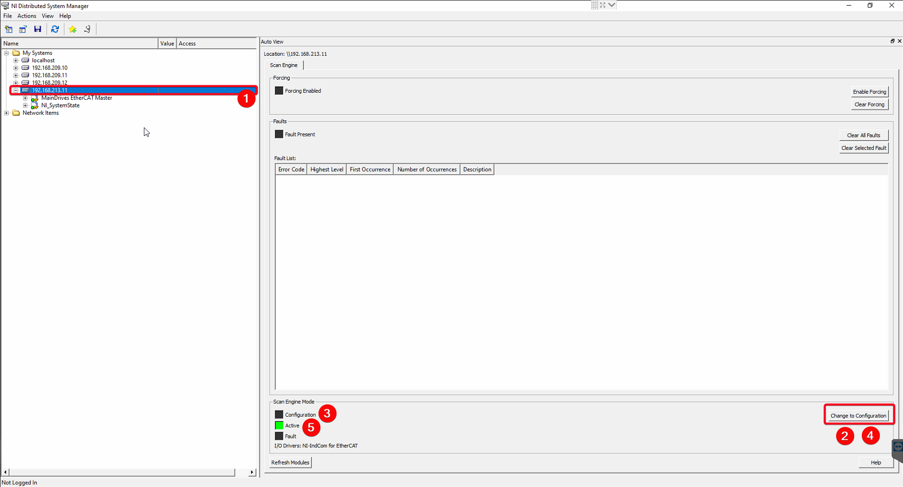

# Manage EtherCAT Line Status

| **Requested by:** | **GHESA**       |
| ----------------- | --------------- |
| **Doc. Code**     | --              |
| **Editor:**       | Alberto Izpizua |
| **Approved by:**  | Julen García    |

## Introduction

This repository has the documentation to diagnose if the EtherCAT lines are working properly and to restore the EtherCAT
lines if necessary. The diagnosis shown in this document is very basic, and only allows to now if the EtherCAT lines
are working properly or not (The NI EtherCAT master does not allow a better diagnose). For a deeper diagnose refer to
[EtherCAT Line diagnosis](https://ts-tma.lsst.io/docs/tma_maintenance_ethercat_ethercat-line-diagnostic/EtherCAT-Line-Diagnostic.html).

There are two EtherCAT lines, one attached to the TMA-PXI axis and the other to the AXES PXI. These lines work in a totally
independent way.

* TMA PXI - Remote IOs and Phase Power supply - EtherCAT line.
  * Master TMA-PXI (139.229.171.3).
  * Slaves:
    * Phase power supply.
    * Distributed IOs. They manage the fluid sensors, temperature controllers, limit switches, Bosch motors power supply, and others.
* AXES PXI - Phase Drives - EtherCAT line.
  * Master AXES PXI (139.229.171.26).
  * Slaves:
    * Azimuth motor drives.
    * Azimuth hall effect sensor.
    * Elevation motor drives.
    * Elevation hall effect sensors.
    * cRIO for EIB synchronization.

## Check EtherCAT status

To check that the EtherCAT status is working properly there are two elements to check. When the EtherCAT line falls down the slave does not update the actual value, so the idea is to check that the actual values are updating.

### TMA PXI - Remote IOs and Phase Power supply - EtherCAT line

Go to Power supply window and check that current has a not constant value in the graph. Also in the Cabinet 0101 Thermal control window, check that the values for the valve feedback and surface temperature are not constant in the graph.

Also, check that there is no error in the NI Distributed system manager for the TMA-PXI target (139.229.171.3).

### AXES PXI - Phase Drives - EtherCAT line

Go to All data view window and select Azimuth Drives. Then in the values table navigate to ensure that all feedback currents are not constant values. Then, change the selection to Elevation drives and check for elevation drives too.

Also, check that there is no error in the NI Distributed system manager for the TMA-PXI target (139.229.171.26).

## Restore EtherCAT line

To restore de EtherCAT line use the NI distributed system manager in a PC with access to the TMA VLAN 139.229.171.X. The PC for Tekniker remote support has this ability.

### TMA PXI - Remote IOs and Phase Power supply - EtherCAT line

<mark>**To restore the EtherCAT line for the TMA-PXI be sure to switch off the next elements**</mark>

* Phase Power supply
* Mirror Cover
* Mirror Cover Locks
* Balancing system
* Deployable Platforms
* Camera Cable Wrap
* Camera rotator
* Azimuth
* Azimuth Cable Wrap
* Azimuth Motor Thermal system
* Elevation Motor Thermal system
* Cabinet 0101 thermal control

The steps for restoring the EtherCAT line are:

 1. Select the TMA-PXI target (139.229.171.3)
 2. Press Change to Configuration button
 3. The EtherCAT line goes to configuration state
 4. Press the Change To Active button
 5. The EtherCAT line goes to active state

### AXES PXI - Phase Drives - EtherCAT line

<mark>**To restore the EtherCAT line for the AXE PXI be sure to switch off the next elements**</mark>

* Azimuth
* Elevation
* Encoder System

The steps for restoring the EtherCAT line are:

 1. Select the TMA-PXI target (139.229.171.26)
 2. Press Change to Configuration button
 3. The EtherCAT line goes to configuration state
 4. Press the Change To Active button
 5. The EtherCAT line goes to active state

